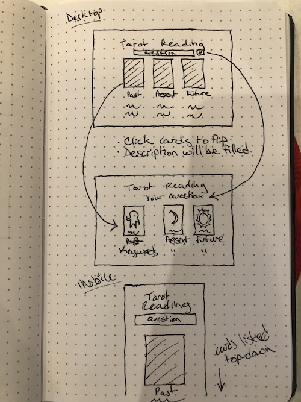

# Tarot Reading

## Description

This application will provide a web-based interface for simulated tarot card readings. The user will be provided with a text input to enter their question, which will subsequently be displayed at the top of the page. Beneath their question will be a spread of three cards, face-down. Clicking the cards will reveal them, and a description of the cards will fill the space beneath each one.

## Wireframes

## API

The application will utilize the RWS Tarot Card API, found here: https://rws-cards-api.herokuapp.com/

The API will be used to provide an array of three random card objects from their database of all 78 tarot cards. The API will provide the name and description of each card shown to the user.

## Features

#### Question Input

The web page will utilize a text input field at the top of the screen where users can type in their own question to "ask the cards," which will subsequently be displayed above their reading so that they may refer back to the question they asked as they explore each card.

#### Randomized Card Selection

After submitting a question, the screen will be populated with 3 face-down cards unique to each reading. When clicked, the card will be flipped, populated by a randomly generated card value from the API, and a description of its meaning will generate below the card's position. This functionality will apply to all three cards and no duplicates will be produced.

#### Reversed Cards

Cards will have a potential of showing up reversed within a reading. The meaning for these cards will differ, and thus alternative text will display.

#### Clear Board

There will be a button to clear the board and start a new reading at the top of the page. The previous question will disappear and the text input will reappear.

## Stretch Goals

#### Multiple Spreads

One potential feature to be added is a spread selector that will allow the user to choose from several different tarot spreads (ex. Celtic Cross, Triangle, etc.), which will display more cards on the screen in an alternative layout based on their selection.

#### Card Animations

Once the program is fully functional, CSS animations may be incorporated to make the interface more dynamic. This could potentially be a shuffling animation where cards are moved around the screen, or an animation for when each card is flipped.